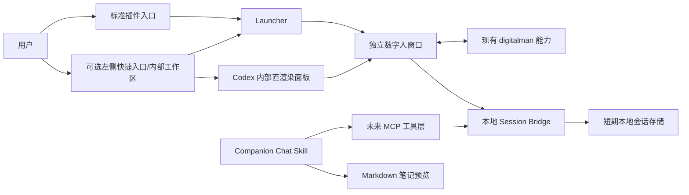

# 技术架构

## 总体设计

## 组件职责

| 组件 | 职责 | 不负责 |
| --- | --- | --- |
| 标准插件 | 分发 Skill，后续声明 MCP 服务 | 修改 Codex 原生侧栏 |
| `codex-entry` | 注入可选快捷按钮和直接渲染的内部数字人面板，并发送受限聊天/主机动作 | 读取 Codex 任务内容、执行任意命令 |
| Launcher | 启动/聚焦窗口，维护单实例和进程生命周期 | 生成聊天摘要 |
| Digitalman Window | 人物呈现、语音/文本交互、结束会话 | 知识库写入 |
| Session Bridge | 会话状态、文本轮次、查询、删除、TTL | 保存音视频、长期记忆 |
| Companion Chat Skill | 选择正确会话并生成 Markdown 预览 | 后台自动整理、静默写入外部系统 |

## 进程边界

建议至少拆成三个进程：Codex Desktop、Launcher/入口宿主、数字人窗口。Session Bridge 初期可以与 Launcher 同进程，接口稳定后再独立。数字人窗口通过 `127.0.0.1` 上的随机端口和短期令牌访问 Bridge。

## 数据流

- 音频与动画留在数字人进程。
- Bridge 只接收最终或已确认的文本轮次，不接收原始音频。
- Launcher 通过子进程环境向数字人 Node 服务传递 Bridge 地址和短期令牌；令牌不进入浏览器。页面通过同源代理提交最终文本，代理再访问环回 Bridge。
- Codex 只在用户要求整理时读取已结束会话。
- 生成的 Markdown 首先进入当前 Codex 任务上下文，由用户决定是否复制、保存或丢弃。

## 降级策略

左侧入口和内部工作区依赖 Codex Desktop 的页面结构，属于易变层。面板直接渲染受控 DOM，不加载 iframe/webview，也不自动打开外部页面。入口整体失效时，用户仍可通过标准插件调用 Launcher；Session Bridge、数字人窗口和笔记整理不依赖 DOM 注入。

## 内部工作区信任边界

- 注入器只在识别到受支持 Codex 版本和预期主界面标记时创建固定 DOM 容器，不读取任务正文、认证信息或页面存储。
- Codex 26.820.60940 会阻止环回 iframe，并拒绝动态 webview guest。内部容器因此直接构造 DOM/CSS，不关闭 Web 安全策略。
- Renderer 不直接访问环回服务；控制器只代理固定 `/api/chat`、`/api/asr/transcribe` 和 `/api/speech` 请求，并拒绝 Renderer 指定 URL、方法、请求头、模型或音色。
- Codex 内部面板使用原项目默认真人角色 `lumi` 的常驻待机视频与 `bedroom_*` 动作视频。控制器只读取同一已校验环回 origin 的固定白名单 MP4，限制 MIME 和大小后送入 Renderer 内存；不使用 iframe、VRM、静态真人照片或任意路径代理。
- Bridge token 不进入 Codex Renderer。内部面板通过受限 CDP binding 请求控制器代理固定聊天接口。
- 麦克风只能由用户在内部面板明确点击后启用；单次录音有大小上限，录音轨道提交后立即停止。原始录音与合成语音只在内存中短暂存在，不进入 Session Bridge、不写入日志或磁盘。
- 人物属性在 Renderer 内存中编辑，控制器再次执行字段长度与音色 key 白名单校验后才发送固定聊天/TTS 接口；不把人物属性写入 Codex localStorage，也不允许 Renderer 指定模型、供应商或底层 voice ID。
- 内部面板不启用 Node 集成、iframe、webview 或弹窗权限。
- 关闭内部工作区只隐藏界面，不静默结束或总结会话；结束会话仍由数字人页面中的显式动作完成。

## 与现有项目的关系

`/Users/Admin/whb/AI/digitalman/` 继续维护数字人本体。本仓库先定义适配契约，不复制模型、素材和运行环境。第一版适配器只需支持：启动、聚焦、开始会话、提交文本轮次、结束会话和健康检查。
