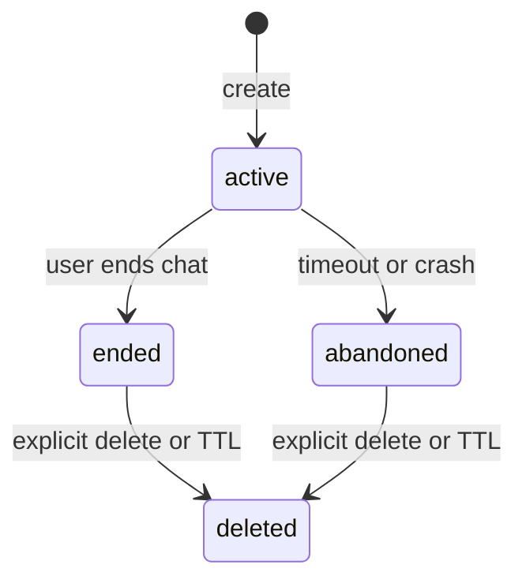

# 会话协议

该文档是数字人窗口、Session Bridge 和未来 MCP 服务之间的契约。实现前可以调整；实现后变更需保留版本兼容或提升协议版本。

## 状态机



只有 `ended` 会话可以进入默认整理流程。`abandoned` 必须由用户明确选择后才能整理。

## 会话对象

```json
{
  "protocol_version": "1",
  "session_id": "ses_01...",
  "status": "ended",
  "character_id": "lumi",
  "started_at": "2026-08-14T10:00:00+08:00",
  "ended_at": "2026-08-14T10:18:00+08:00",
  "locale": "zh-CN",
  "messages": [
    {
      "message_id": "msg_01...",
      "role": "user",
      "text": "今天脑子有点转不动。",
      "created_at": "2026-08-14T10:01:03+08:00",
      "source": "speech-final"
    }
  ]
}
```

`role` 只允许 `user`、`assistant` 和 `system-event`。`source` 初期只允许 `typed`、`speech-final`、`assistant-final`。不要写入语音中间结果。

## 本地 HTTP API

| 方法 | 路径 | 用途 |
| --- | --- | --- |
| `POST` | `/v1/sessions` | 创建会话 |
| `POST` | `/v1/sessions/{id}/messages` | 追加最终文本轮次 |
| `POST` | `/v1/sessions/{id}/end` | 显式结束会话 |
| `GET` | `/v1/sessions/latest?status=ended` | 获取最近一次已结束会话 |
| `GET` | `/v1/sessions/{id}` | 获取指定会话 |
| `DELETE` | `/v1/sessions/{id}` | 删除会话 |
| `GET` | `/healthz` | 健康检查，不返回会话数据 |

所有请求必须携带 Launcher 生成的短期 Bearer token。服务仅监听 `127.0.0.1` 或 Unix Domain Socket。

### 请求与响应

- `POST /v1/sessions` 接受可选的 `character_id` 和 `locale`；默认分别为 `lumi`、`zh-CN`，成功返回 `201` 和完整会话对象。
- `POST /v1/sessions/{id}/messages` 接受 `role`、`text`、`source`，成功返回 `201` 和新增消息。只允许向 `active` 会话追加消息，`text` 必须为 1 至 10,000 个 Unicode 字符。
- `POST /v1/sessions/{id}/end` 不需要请求体，成功返回 `200` 和结束后的完整会话；重复结束是幂等操作。
- 查询接口成功返回 `200` 和完整会话对象。`latest` 首版只接受 `status=ended`，并按 `ended_at` 选择最近会话。
- 删除成功返回 `204` 且无响应体。会话不存在或已经删除均返回 `404`。
- `GET /healthz` 成功返回 `{"status":"ok","protocol_version":"1"}`，但仍要求 Bearer token。

所有 JSON 错误使用固定结构：

```json
{
  "error": {
    "code": "session_not_found",
    "message": "Session not found"
  }
}
```

首版错误码为 `unauthorized`、`invalid_request`、`not_found`、`session_not_found`、`session_not_active`、`no_matching_session` 和 `payload_too_large`。未知字段被忽略；畸形 JSON、错误枚举值和空文本返回 `400 invalid_request`。请求体上限为 64 KiB。

## 计划中的 MCP 工具

- `digitalman_open_session(topic?)`：启动/聚焦窗口并创建会话。
- `digitalman_get_session(session_id | "latest")`：读取已结束会话；默认 `latest`。
- `digitalman_delete_session(session_id)`：显式删除原始会话。

窗口负责结束会话，因此 MVP 不要求 Codex 暴露远程结束工具。插件清单在这些工具真正可用前不得声明 `mcpServers`。

## Codex 内部面板请求

可选的 `codex-entry` Renderer 不直接访问环回 HTTP 服务，也不接收 Launcher 或 Bridge token。它只能通过 `codexDigitalmanHostAction` CDP binding 发送以下消息：

- 字符串 `open-digitalman`：创建内部会话并准备本地服务。
- JSON `{"action":"chat","requestId":"<1-64 个安全字符>","message":"<1-2000 字符>","history":[...],"character":"lumi|xiaotao","persona":{...},"voice":"<key>"}`：向已准备的内部会话发送最终消息。`history` 最多 6 条，只允许 `user`/`assistant` 与最多 4000 字符的 `content`；角色只允许原项目声明的 `lumi` 和 `xiaotao`。`persona` 仅允许 `name`（20）、`relationship`（40）、`style`（160）、`background`（240）四个裁剪字段；`voice` 只允许最多 40 个安全 key，由控制器交给本地 `/api/speech` 的服务端目录解析，Renderer 不能指定 voice ID、模型或供应商。
- 音频通过若干 `{"action":"transcribe-chunk","requestId":"...","index":0,"total":4,"chunk":"..."}` 与最后一个 `{"action":"transcribe-commit","requestId":"...","mimeType":"audio/wav"}` 提交。每片 Base64 最多 16 KiB、总计最多 350 片，缺片、重复片或超过 60 秒的请求都拒绝。Renderer 仅在用户明确点击麦克风后录音，并在内存中转换为 16 kHz 单声道 PCM16 WAV；音频最多 4 MiB，控制器重组后只代理固定 `/api/asr/transcribe`，不写入会话或磁盘；识别成功后 Renderer 才把最终文本作为 `speech-final` 轮次提交聊天。

麦克风按钮遵循数字人本体的连续通话语义：第一次点击进入通话并持续监听，Renderer 使用自适应 VAD 检测有效人声，在约 620 ms 静音后自动提交一轮；回复语音结束后自动恢复监听。第二次点击才结束通话并释放麦克风。每句话不要求再次点击按钮。

控制器通过版本化的 `codex-digitalman-transcribe-result-v3` 返回最多 2000 字符的最终识别文本；通过 `codex-digitalman-chat-result-v3` 返回 `requestId`、经过裁剪的 `reply`、`emotion`，以及可选的 `speechDataUrl`。回复音频只能来自固定 `/api/speech`，MIME 只允许 WAV/MPEG/MP4 且最多 8 MiB，只在 Renderer 内存中播放。事件名必须在桥接行为变化时升级，避免热重载后旧 Renderer 监听器抢先消费结果。Renderer 不能指定目标 URL、HTTP 方法、请求头、模型、音色或主机动作；控制器只访问 Launcher 先前返回并再次通过环回校验的 origin。

版本化的 `codex-digitalman-ready-v3` 不携带人物照片。内部面板在正确角色素材完成前只显示本地占位形象，避免误用数字人本体项目中的其他人物图片。

真人人物支持 `lumi`（露米）和 `xiaotao`（小桃）。ready 事件可附带固定白名单 `realCharacters`，每个角色只含其固定待机视频；每段必须为 `video/mp4` 且有独立大小上限。Renderer 只在内存中创建 Blob URL，重新注入时全部撤销，不接收任意素材路径。

ready 事件还可附带 `/api/voices` 返回并经控制器裁剪的 `voiceCatalog`（`defaultKey` 和最多 20 个 `{key,label,description}`）。人物设置仅保存在当前 Renderer 会话内存；不得写入 Codex 页面存储、日志或 Session Bridge 原始音视频。

控制器完成 TTS 后，将同一 PCM WAV 代理到固定 `/api/dinet/render?action=<允许动作>&character=<允许角色>`。只接受响应中的 `/dinet-avatar/generated/<安全文件名>.mp4`，再次从同一 origin 读取、验证 `video/mp4` 和大小后，以 `avatarSpeechDataUrl` 返回。Renderer 优先播放该带口型的回复视频；DINet 不可用时降级为待机视频加原 TTS 音频。

## 保留策略

默认保留 24 小时或最近 10 次会话，任一条件先达到即清理。持久化文件使用用户目录下专用数据目录、权限 `0700/0600`；开发日志不得记录消息正文或令牌。
